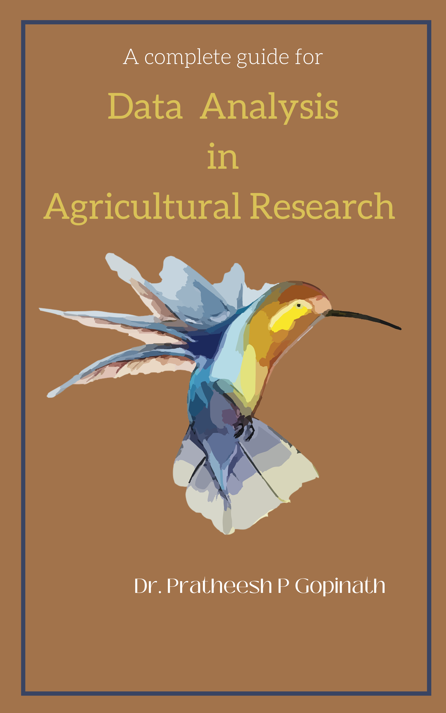

---
title: "DATA ANALYSIS USING STATISTICAL PACKAGES "
author: "Dr. Pratheesh P. Gopinath"
date: "2022-01-30"
site: bookdown::bookdown_site
documentclass: book
bibliography: [book.bib]
biblio-style: apalike
link-citations: yes
github-repo: https://github.com/KAUMELON/BSTA-2104
description: "A BOOK FOR BTECH BIOTECHNOLOGY"
cover-image: images/cover.PNG
---  
 

# Welcome {-} 
<p style="text-align: center;"><a href="https://coavellayani.kau.in/people/dr-pratheesh-p-gopinath"></a></p>  
Welcome to the online version of the book **DATA ANALYSIS USING STATISTICAL PACKAGES **.  
<p>This book is a collection of all lecture notes covering the syllabus of DATA ANALYSIS USING STATISTICAL PACKAGES  course  (STAT 531) in Post Graduate programme of Kerala Agricultural University </p> 


# Preface {-}  
<p style="text-align: justify;">
</p>  
<p style="text-align: justify;"> **Note**: This book is published in MeLoN (Module for e-Learning & Online Notes) . The online version of this book is free to read here.</p> 
````{=html}
<a rel="license" href="http://creativecommons.org/licenses/by-nc-nd/4.0/"></a><br />This work is licensed under a <a rel="license" href="http://creativecommons.org/licenses/by-nc-nd/4.0/">Creative Commons Attribution-NonCommercial-NoDerivatives 4.0 International License</a>.
````
<p>If you have any feedback, please feel free to contact [Dr.Pratheesh P. Gopinath](https://coavellayani.kau.in/people/dr-pratheesh-p-gopinath). E-mail: `pratheesh.pg@kau.in` Thank you!</p>  

```{r logo, echo=FALSE,out.width="30%", fig.align='center'}
knitr::include_graphics(rep("docs/logo.png"))
```


<!--chapter:end:index.Rmd-->

# Syllabus {-}  

## Objective {-}   

This course is meant for exposing the students in the usage of various statistical
packages for analysis of data. It would provide the students an hands on experience in
the analysis of their research data. This course is useful to all disciplines.  

## UNIT I {-}  

Use of Software packages for: Summarization and tabulation of data; Descriptive
statistics; Graphical representation of data, Exploratory data analysis.

## UNIT II {-}  

Fitting and testing the goodness of fit of discrete and continuous probability
distributions; Testing of hypothesis based on large sample test statistics; Testing of
hypothesis using chi-square, t and F statistics.  

## UNIT III {-}  

Concept of analysis of variance and covariance of data for single factor, multi-factor,
one-way and multi-classified experiments, contrast analysis, multiple comparisons.  

## UNIT IV {-}  

Analysis of mixed models; Estimation of variance components; Testing the significance
of contrasts; Correlation and regression including multiple regression.  

## UNIT V {-}  

Discriminant function; Factor analysis; Principal component analysis; Analysis of time
series data, Fitting of non-linear models; Time series data. 


<!--chapter:end:01.rmd-->

# Introduction  
Data science is a fast growing field with the development of advanced
statistical tools for data analysis and visualization. When the data
volume is large and also when precision is required, we depend on
statistical software to get better insights from the data. Statistical
software makes analysis easy, produces more precise results, enables us
to use complex statistical tools and generates advance complex graphical
outputs.

One cannot blindly depend upon statistical software for data analysis,
as you can use any software for data analysis as per your convenience.
Even some of the basic statistical tools, you can perform calculations
manually. Without proper knowledge in statistics, every software is a
garbage in garbage out. What that really matters is knowledge in
statistical concepts and tools, so that effective interpretations can be
made from the data.

Agricultural experiments demand a wide range of statistical tools for
analysis, which includes exploratory analysis, design of experiments,
and statistical genetics. It is a challenge for scientists and students
to find a suitable platform for data analysis and publish the research
outputs in quality journals. Most of the software available for data
analysis are proprietary or lack a simple user interface. The open
source programming language R and associated ecosystem of packages,
provides an excellent platform for data analysis but as of yet, is not
heavily utilized by researchers in agricultural disciplines.
Insufficient programming and computational knowledge are the primary
challenges for agricultural researchers using R for analysis.

In our sessions, I will be using R studio. I believe that, there is no
need for agricultural scientist and students to learn R as a programming
language, as majority of you would like to have their data analyzed and
make inference from it. I have seen agricultural researchers take up R
workshops and leave it behind as such workshops mainly deals with code
chunks; user will get easily tired of that. Beauty of R is that, it is a
free open-source software. Apart from the software used, I again insist
that students and researchers should strengthen their basic statistics
knowledge and they should be able to decide, what tool should be used
and when. I strongly recommend that you should go through the basic
statistical theory by visiting my e-book [Textbook of Agricultural Statistics](https://kaumelon.github.io/stat3202/). Before proceeding further, one
should also have a basic knowledge about different statistical software
available.

## Statistical Software

Statistical analysis software are specialized programs designed to allow
users to perform complex statistical analysis. These software typically
provide tools for the organization, interpretation, and presentation of
selected data sets. Statistical analysis capabilities refer to
capabilities that support analysis methodologies such as regression
analysis, predictive analytics, and statistical modelling, among many
other basic tools.

### Types of statistical software

#### Open-source software

Open-source software (OSS) is non-proprietary software that allows
anyone to modify, enhance, or simply view the source code behind it. It
can enable programmers to work or collaborate on projects created by
different teams, companies, and organizations. Open-source software
authors do not view their creations as proprietary and instead release
their software under licenses that grant users with the desire and
know-how to view, copy, learn, alter, and share its code.

OSS is shared in a public repository, granting access to anyone who
wants to work on the source code. However, open-source software tends to
come with a distribution license, which establishes how people can
interact, modify, and share the OSS.

Once changes are made to the source code, the OSS should signify those
changes and what methods were used to make them. Also, depending on the
license, the resulting OSS may or may not be required to be free. With
that, most open-source software is free but some require up-front costs
or subscription fees.

Few open source software are

-   **R** and **Rstudio** (GUI interface and development environment for R)

-   **gretl** -- gnu regression, econometrics and time-series library

-   **JASP** -- A free software alternative to IBM SPSS Statistics with
    additional option for Bayesian methods

-   **Orange** - a data mining, machine learning, and bioinformatics
    software

-   **Weka** (machine learning) -- a suite of machine learning software
    written at the University of Waikato

-   **Perl** Data Language -- Scientific computing with Perl

#### Public Domain

Public domain software is any software that has no legal, copyright or
editing restrictions associated with it. It is free and open-source
software that can be publicly modified, distributed or sold without any
restrictions.

-   **Dataplot** - It is a public domain software system for scientific
    visualization and statistical analysis. It was developed and is
    being maintained at the National Institute of Standards and
    Technology. Dataplot\'s source code is available and in public
    domain

-   **CSPro** - CSPro is short for the Census and Survey Processing System,
    is a public domain data processing software package developed by the
    U.S. Census Bureau and ICF International.

#### Freeware

Freeware is software, most often proprietary, that is distributed at no
monetary cost to the end user. There is no agreed-upon set of rights,
license that defines freeware unambiguously; every publisher defines its
own rules for the freeware it offers. For instance, modification,
redistribution by third parties, and reverse engineering are permitted
by some publishers but prohibited by others. Unlike with free and
open-source software, which are also often distributed free of charge,
the source code for freeware is typically not made available. Freeware
may be intended to benefit its producer by, for example, encouraging
sales of a more capable version

-   **BV4.1**- The application software BV4.1 is an easy-to-use tool for
    decomposing and seasonally adjusting monthly or quarterly economic
    time series by version 4.1 of the Berlin procedure. It is being
    developed by the Federal Statistical Office of Germany. The software
    is released as freeware for non-commercial purposes.

-   **GeoDa** - It is a free software package that conducts spatial data
    analysis, geo-visualization, spatial autocorrelation and spatial
    modeling. Maintained from 2016 by Centre for Spatial Data Science
    (CSDS) at the University of Chicago, originally developed by Spatial
    Analysis Laboratory of the University of Illinois at
    Urbana-Champaign

-   **WinPepi** - It is a freeware package of statistical programs for
    epidemiologists, comprising seven programs with over 120 modules.

##### Proprietary software

It is also known as non-free software or closed-source software, is
computer software for which the software\'s publisher or another person
reserves some licensing rights to use, modify, share modifications, or
share the software, restricting user freedom with the software they
lease. It is the opposite of open-source or free software. Non-free
software sometimes includes patent rights. Some of the few well known
proprietary statistical software are:-

**SAS** - SAS (previously \"Statistical Analysis System\") is a statistical
software suite developed by SAS Institute for data management, advanced
analytics, multivariate analysis, business intelligence, criminal
investigation and predictive analytics. SAS was developed at North
Carolina State University from 1966 until 1976, when SAS Institute was
incorporated. SAS was further developed in the 1980s and 1990s with the
addition of new statistical procedures, additional components and the
introduction of JMP.

**SPSS Statistics** -- SPSS Statistics is a statistical software suite
developed by IBM for data management, advanced analytics, multivariate
analysis, business intelligence, and criminal investigation. Long
produced by SPSS Inc., it was acquired by IBM in 2009. Current versions
(post 2015) have the brand name: IBM SPSS Statistics. The software name
originally stood for Statistical Package for the Social Sciences (SPSS),
reflecting the original market, then later changed to Statistical
Product and Service Solutions.

**Stata** -- It is a general-purpose statistical software package developed
by StataCorp for data manipulation, visualization, statistics, and
automated reporting. It is used by researchers in many fields, including
biomedicine, epidemiology, sociology and science. Stata was initially
developed by Computing Resource Center in California and the first
version was released in 1985. In 1993, the company was renamed Stata
Corporation, now known as StataCorp.

**Genstat** (General Statistics) - It is a statistical software package with
data analysis capabilities, particularly in the field of agriculture. It
was developed in 1968 by Rothamsted Research in the United Kingdom and
was designed to provide modular design, linear mixed models and graphic
functions. It is developed and distributed by VSN International (VSNi),
which is owned by The Numerical Algorithms Group and Rothamsted
Research.

**Minitab** -- Minitab is a statistics package developed at the Pennsylvania
State University by researchers Barbara F. Ryan, Thomas A. Ryan, Jr.,
and Brian L. Joiner in conjunction with Triola Statistics Company in
1972. It began as a light version of OMNITAB 80, a statistical analysis
program by National Institute of Standards and Technology.

**MATLAB** -- MATLAB an abbreviation of \"MATrix LABoratory\" is a
proprietary multi-paradigm programming language and numeric computing
environment developed by MathWorks. MATLAB allows matrix manipulations,
plotting of functions and data, implementation of algorithms, creation
of user interfaces, and interfacing with programs written in other
languages.

**EViews** -- EViews is a statistical package for Windows, used mainly for
time-series oriented econometric analysis. It is developed by
Quantitative Micro Software (QMS). EViews can be used for general
statistical analysis and econometric analyses, such as cross-section and
panel data analysis and time series estimation and forecasting. EViews
combines spreadsheet and relational database technology with the
traditional tasks found in statistical software, and uses a Windows GUI
(Graphical User Interface).

For agricultural researchers I recommend using RStudio for data
analysis, as it is easy to use. RStudio allows users to develop and edit
programs in R by supporting a large number of statistical packages,
higher quality graphics, and the ability to manage your workspace. We have developed a R package `grapesAgri1` for agricultural research. We will be discussing this package towards last session. To read more on please see [grapesAgri1](https://joss.theoj.org/papers/10.21105/joss.03437)

<!--chapter:end:02.Rmd-->

# R and R studio  

This training program is tailored to equip you with the skills needed for multivariate data analysis using R and RStudio. In this introductory section, we will provide you with a brief overview and guide you through the process of installing R and RStudio.  


## R  
R is a programming language for statistical computing and graphics supported by the R Core Team and the R Foundation for Statistical Computing. Created by statisticians Ross Ihaka and Robert Gentleman. R is an implementation of the S programming language. R is used among data miners, bioinformaticians and statisticians for data analysis and developing statistical software. Users have created packages to augment the functions of the R language.
According to user surveys and studies of scholarly literature databases, R is one of the most commonly used programming languages used in data mining. The official R software environment is an open-source free software environment within the GNU package, available under the [GNU General Public License](https://www.gnu.org/licenses/gpl-3.0.en.html). It is written primarily in C, Fortran, and R itself (partially self-hosting). R has a command line interface. Multiple third-party graphical user interfaces are also available, such as RStudio, an integrated development environment.  

```{r rlogo, echo=FALSE,fig.cap='R logo',out.width="30%", fig.align='center'}
knitr::include_graphics(rep("images/downloadR/rlogo.png"))
```

## Rstudio  
RStudio is an integrated development environment (IDE) for R. It includes a console, syntax-highlighting editor that supports direct code execution, as well as tools for plotting, history, debugging and workspace management. RStudio is available in open source and commercial editions and runs on the desktop (Windows, Mac, and Linux) or in a browser connected to RStudio Server. RStudio is a free and open-source integrated development environment (IDE) for R, a programming language for statistical computing and graphics. JJ Allaire, creator of the programming language ColdFusion, founded RStudio. RStudio is available in two editions: RStudio Desktop, where the program is run locally as a regular desktop application; and RStudio Server, which allows accessing RStudio using a web browser while it is running on a remote Linux server.  

RStudio is written in the C++ programming language and uses the Qt framework for its graphical user interface. Work on RStudio started at around December 2010, and the first public beta version (v0.92) was officially announced in February 2011.  

```{r rstudio1, echo=FALSE,fig.cap='R studio logo',out.width="30%", fig.align='center'}
knitr::include_graphics(rep("images/downloadR/rstudiologo.png"))
```

Typical RStudio window has four panes as explained below  

```{r rstudio2, echo=FALSE,fig.cap='R studio window',out.width="80%", fig.align='center'}
knitr::include_graphics(rep("images/downloadR/rstudiowindow.png"))
```

1. **Console**

This is where the action happens. Here any authentic R code typed after the ‘>’ prompt will be executed after pressing ‘Enter’ to generate the output. This is where we are going to type our single call function to start our app for data analysis.  

2. **Source Editor**

This is where R scripts (collection of code) can be created and edited. New R script can be opened by clicking File --> New File --> R Script or using short cut `ctrl+shift+N`. You can type your codes here. To run a code in console or execute, place the cursor in the line which code is written and press `ctrl+enter` or highlight the code you wish to evaluate and clicking on the “Run” button on the top right of the Source. You can save your R codes, written in script.   

3. **Environment|History|Connections**

All of the data objects (such as vectors, matrices, and dataframes) that you have defined in your current R session are listed under the Environment tab of this panel. In data objects, you may also examine details like the quantity of observations and rows. A few other clickable options are available on the tab, such as `Import Dataset`, which will launch a graphical user interface (GUI) for inputting data into R.  

This panel's History tab only provides a history of all the code that you have previously evaluated in the Console.  

The Environment / History panel could be helpful as you become more accustomed to R. However, you can ignore it right now. You can simply just reduce the window by clicking the minimise button in the panel's upper right corner if you wish to clear up space on your screen. 

4. **Files|Plots|Packages|Help|Viewer**  

You can find a collection of useful information in the Files|Plots|Packages|Help panel. Let's examine each tab in more detail:  
- The file directory on your hard disc is accessible through the files panel. You can utilise the "Files" panel to set your working directory by clicking "More" and then "Set As Working Directory" once you've navigated to the folder where you wish to read and save files.  

- All of your plots are displayed in the Plots panel. There are buttons to export the plot as a pdf or jpg and to open the plot in a separate window.  
We are interested in the install button in this pane, to install packages required for our analysis.

## Installing R
Follow below steps in correct order for installation of R
 
### First install R latest version  

To install R on Windows OS:  

Go to the [CRAN](https://cran.r-project.org/) website.

**Click on "Download R for Windows"**.  
```{r crandown, echo=FALSE,fig.cap= "",out.width="70%", fig.align='center'}
knitr::include_graphics(rep("images/downloadR/cranwindow.png"))
```  

**Click on "install R for the first time"**.
```{r crandown2, echo=FALSE,fig.cap= "",out.width="70%", fig.align='center'}
knitr::include_graphics(rep("images/downloadR/cranwindow2.png"))
```  

**Click on "Download R-4.3.1 for windows" link to download the R executable (.exe) file**.(By the time of writing this manual R version was 4.3.1, it may change in future)  
```{r crandown3, echo=FALSE,fig.cap= "",out.width="70%", fig.align='center'}
knitr::include_graphics(rep("images/downloadR/cranwindow3.png"))
``` 

After downloading the file. Run the R executable file by double clicking on the downloaded file to start installation, and allow the app to make changes to your device.  

**Select the installation language.**  
```{r crandown4, echo=FALSE,fig.cap= "",out.width="50%", fig.align='center'}
knitr::include_graphics(rep("images/downloadR/exefile.png"))
```  

**Follow the installation instructions**.  
```{r crandown5, echo=FALSE,fig.cap= "",out.width="50%", fig.align='center'}
knitr::include_graphics(rep("images/downloadR/setup.png"))
```  
**Click next and wait for the installation to complete**.  
```{r crandown6, echo=FALSE,fig.cap= "",out.width="70%", fig.align='center'}
knitr::include_graphics(rep("images/downloadR/setupinstall.png"))
```
**Click on "Finish" to exit and complete the installation setup.**  
```{r crandown7, echo=FALSE,fig.cap= "",out.width="70%", fig.align='center'}
knitr::include_graphics(rep("images/downloadR/completeinstall.jpg"))
```
**You can now run R from the start menu or the shortcut created on your desktop**  

```{r crandown8, echo=FALSE,fig.cap= "",out.width="70%", fig.align='center'}
knitr::include_graphics(rep("images/downloadR/Rfinal.png"))
```

```{block2 items, type='rmdnote'}
R studio is GUI for R, so keep this in mind. Before installing R studio you should install R.   
```  

## Installing Rstudio
After installing latest version of R. Go to the [Rstudio](https://posit.co/download/rstudio-desktop/) website.  

Click on "DOWNLOAD RSTUDIO DESKTOP FOR R"  
```{r rinsatll, echo=FALSE,fig.cap= "",out.width="50%", fig.align='center'}
knitr::include_graphics(rep("images/downloadR/rstudio1.png"))
``` 

Now like you have completed the installation of R, complete the installation setup of Rstudio. After installation you can now run R from the start menu or the shortcut created on your desktop.   

Now you are ready to explore the world of data analysis and unleash the potential of R and RStudio to unlock valuable insights from your datasets. Happy Statistics with R!  


#### The above descriptions are sourced from: {-}

[The R Project for Statistical Computing](https://www.r-project.org/)

[RStudio](https://www.rstudio.com/)

[Wikipedia R (programming language)](https://en.wikipedia.org/wiki/R_(programming_language))

[Wikipedia RStudio](https://en.wikipedia.org/wiki/RStudio)  

<!--chapter:end:03.Rmd-->

# R basics {#rbase} 

In this section we will be dealing with basic operations using R. One should be aware of these basics before proceeding to any kind of data analysis using R.  

The RStudio interface is simple. You type R code into the bottom line of the RStudio console pane (see figure \@ref(fig:rstudio2)) and then click Enter to run it. The code you type is called a command, because it will command your computer to do something for you. The line you type it into is called the command line.  

>'#' hashtag in R  
R treats the hashtag character, '#'in a special way; R will not run anything that follows a hashtag on a line. This makes hashtags very useful for adding comments and annotations to your code. We will be able to read the comments, but your computer will not process it.

## Basic arithmetic operations  

```{r}
# Try these codes in R, Type these codes in console and hit enter
# result of R code is also shown here  

# + (Addition)   
7 + 4  

# - (Subtraction)  
7 - 4  

# * (Multiplication)
7 * 2  

# / (division) 
7 / 2  

# ^ (exponentiation) 
7 ^ 2
```  

The colon operator (`:`) returns every integer between two integers. It is an easy way to create a sequence of numbers.  

```{r}
100:130
```  


## Basic arithmetic functions:  

```{r}  
# Logarithm to the base e  
log(4)  
# Logarithm to the base 10  
log10(4)  
# Logarithm to the base 2  
log2(4)  
# absolute value
abs(-4)  
# square root
sqrt(4) 

```


## Assigning values to variables  

```{r}  
x <- 2
# it is that value 2 is assigned to variable x  

y <- 5  

# it is that value 5 is assigned to variable y

# Now if you give x+5 or using any operator between x and y, you can see as below  

x + y  
x * y  
x / y  
x + 2*y  

```

> Note that R is case sensitive, i.e. x and X are not equal.  

## Basic data types  

+ numeric  
+ character  
+ logical  

```{r}
my_age <- 32   
# Numeric variable 32 is assigned to my_age

# while writing your code it is preffered to use '_' instead of space  

my_name <- "Dr Pratheesh" # Character variable  

#  Are you a data scientist?: (yes/no) <=> (TRUE/FALSE)  

is_datascientist <- TRUE # logical variable

```  

### Vectors  

A combination of multiple values (numeric, character or logical)  

#### How to create a vector {-}
Create a vector: c() for concatenate  

Case of missing values: **NA** (not available) and **NaN** (not a number)  

Get a subset of a vector: my_vector[i] to get the i^th^ element

```{r}  
# Create a numeric vector
student_ages <- c(27, 25, 29, 26, 20, 21, 23, 25)  

# Create a character vector
student_name <- c("asha", "adhi", "aravind", 
                  "mary", "peter", "daisy", 
                  "papu", "ramu")  

# subset of a vector  

# obtain 3 rd element from student_name  

student_name[3]

```


> Case of missing values: **NA** (not available) and **NaN** (not a number)
> Get a subset of a vector: my_vector[i] to get the ith element  

#### Calculations with vectors {-}  
> max(x), min(x), range(x), length(x), sum(x), mean(x), prod(x): product of the elements in x, sd(x): standard deviation, var(x): variance, sort(x)  

```{r}  
# Create a numeric vector
student_ages <- c(27, 25, 29, 26, 20, 21, 23, 25)  

# Maximum value of the vector
max(student_ages)

# Minimum value of the vector
min(student_ages)

# Range of the vector
range(student_ages)  

# Length of the vector
length(student_ages)  

# Total of the values in the vector
sum(student_ages)

# Mean of the vector
mean(student_ages)  

# Product of the elements in the vector
prod(student_ages)

# Standard deviation  
sd(student_ages)

# Variance of the vector
var(student_ages)

# Sort the values of the vector

# Ascending order
sort(student_ages,decreasing = FALSE)

# Descending order
sort(student_ages,decreasing = TRUE)
```
  
### Matrices  

It’s a homogeneous collection of data sets which is arranged in a two dimensional organisation. It’s a m*n array with similar data type. It is created using a vector input. It has a fixed number of rows and columns. You can perform many arithmetic operations on R matrix like – addition, subtraction, multiplication, and divisions.  

Create and naming matrix: matrix(), cbind(), rbind(), rownames(), colnames()
Transpose a matrix: t()
Dimensions of a matrix: ncol(), nrow(), dim()
Get a subset of a matrix: my_data[row, col]
Calculations with numeric matrices: rowSums(), colSums(), rowMeans(), colMeans()

```{r}
# make three vectors c1, c2 and c3
c1<-c(3,4,5)
c2<-c(7,8,9)
c3<-c(11,12,13)

# Creating matrix by binding column wise  
A <- cbind(c1,c2,c3)
print(A)

# Creating matrix by binding row wise  
B <- rbind(c1,c2,c3)
print(B)  

# Adding two matrices
A+B

# Simple element by element multiplication up to matrices.

A*B

# Matrix multiplication  

A%*%B

# Using matrix() function
# Elements are arranged sequentially by row.
M <- matrix(c(3:14), nrow = 4, byrow = TRUE)
print(M)

# Elements are arranged sequentially by column.
N <- matrix(c(3:14), nrow = 4, byrow = FALSE)
print(N)

# Define the column and row names.
rownames = c("row1", "row2", "row3", "row4")
colnames = c("col1", "col2", "col3")

P <- matrix(c(3:14), nrow = 4, byrow = TRUE, dimnames = list(rownames, colnames))
print(P)  

# Access the element at 3rd column and 1st row.
P[1,3]

# Access the element at 2nd column and 4th row.
P[4,2]

# Access only the  2nd row.
P[2,]

# Access only the 3rd column.  
P[,3]  


# Assign element at 1st row and 3rd column of matrix P to the variable x  

x<-P[1,3]  
print(x)

# create a vector from the second column of matrix P  

y<-P[,2]
y<-as.vector(y)

#Transpose a matrix
Q<-t(P)
print(Q)

# Knowing dimensions of a matrix

#Number of columns in A
ncol(A)  

#Number of rows in A
nrow(A)

# Number of rows and columns
dim(A)  

# Calculations with numeric matrices  

# Compute row sums of matrix A
rowSums(A)  

# Compute column sums of matrix A
colSums(A)  

# Compute row means of matrix A
rowMeans(A)  

# Compute column means of matrix A
colMeans(A)

```  

### Data frames  

A data frame is the data type, we will be going to use frequently. A data frame is like a matrix but can have columns with different types (numeric, character, logical). Rows are observations (individuals) and columns are variables. Function `data.frame()` is used to create data frame  

```{r}  
friends_data <- data.frame(
  name = c("asha", "adhi", "aravind", 
                  "mary"), 
  age = c(20,23,22,21),
  height = c(180, 170, 185, 169),
  married = c(TRUE, FALSE, TRUE, TRUE)  
)  

# Print
friends_data
```
To check whether a data is a data frame, use the `is.data.frame()` function. Returns TRUE if the data is a data frame:  

```{r}
is.data.frame(friends_data)  
```  
 
To check whether a data is a matrix, data frame or any other class use the function `class()`  

```{r}
# What is the class of A? --> matrix
class(A)  

# What is the class of friends_data? --> matrix
class(friends_data)
```  

Convert a data class to data frame use the function `as.data.frame()`

```{r}
# Convert it as a data frame
A2 <- as.data.frame(A)
# Now, the class is data.frame
class(A2)
```  

As described in matrix section, you can use the function `t()` to transpose a data frame:  

```{r}  
t(friends_data)
```  

#### Operations on data frame  

Positive indexing by name and by location
```{r}
# Access the data in 'name' column in friends_data
# dollar sign is used
friends_data$name  

# or use this
friends_data[, 'name']  

# Subset columns 1 and 3
friends_data[ , c(1, 3)]  

# Subset columns 1 to 3  
friends_data[ , c(1:3)]    
```  

Negative Indexing  

```{r}
# Exclude column 1  

friends_data[, -1]  
```  
  
  
Index by characteristics

We want to select all friends with age greater than or equal to 22.

```{r}
# Identify rows that meet the condition
friends_data$age >= 22   

# TRUE specifies that the row contains a value of age >= 22.
```  

```{r}  
# Select the rows that meet the condition
friends_data[friends_data$age >= 22, ]  
# The R code above, tells R to get all rows from friends_data where age >= 22
```  

If you don’t want to see all the column data for the selected rows but are just interested in displaying, for example, friend names and age for friends with age >= 22, you could use the following R code:  

```{r}  

# Use column locations
friends_data[friends_data$age >= 22,  c(1, 2)]  

# Or use column names
friends_data[friends_data$age >= 22, c("name", "age")]
```  

If you’re finding that your selection statement is starting to be inconvenient, you can put your row and column selections into variables first, such as:  

```{r}

age22 <- friends_data$age >= 22
cols <- c("name", "age")
# Then you can select the rows and columns with those variables:

friends_data[age22, cols]
```  

It’s also possible to use the function `subset()` as follow.

```{r}
# Select friends data with age >= 22
subset(friends_data, age >= 22)  
```  

Another option is to use the functions `attach()` and `detach()`. The function `attach()` takes a data frame and makes its columns accessible by simply giving their names.  

```{r}
# Attach a data frame
attach(friends_data)
# === Data manipulation ====
friends_data[age>=22, ]
# === End of data manipulation ====
# Detach the data frame
detach(friends_data)
```

**Extend a data frame**  
Add new column in a data frame
```{r}
# Add group column to friends_data
data<-c("BSc", "MSc", "Phd", "Btech")
friends_data$degree <- data
friends_data
```  

It’s also possible to use the functions `cbind()` and `rbind()` to extend a data frame.
```{r}
roll_no<-c(234,235,236,238)
cbind(friends_data, roll_no)
```  
  
**Calculations with data frame**  
  
With numeric data frame, you can use the function `rowSums()`, `colSums()`, `colMeans()`, `rowMeans()` and `apply()`.  

```{r}  
# Following can be used when it is a numeric data frame

# creating a numeric data frame
c1<-c(3,4,5)
c2<-c(7,8,9)
c3<-c(11,12,13)

# Creating matrix by binding column wise  
ex <- cbind(c1,c2,c3)

# converting matrix to data frame
ex<-as.data.frame(ex)
ex

rowSums(ex)
colSums(ex)

# calculation in non numeric data frame on selected numeric columns
attach(friends_data)
sum(age)
mean(age)
```   

`apply()` function  

```
apply(X, MARGIN, FUN)
Here:
  -x: an array or matrix
-MARGIN:  take a value or range between 1 and 2 to define where to apply the function:
  -MARGIN=1`: the manipulation is performed on rows
-MARGIN=2`: the manipulation is performed on columns
-MARGIN=c(1,2)` the manipulation is performed on rows and columns
-FUN: tells which function to apply. Built functions like mean, median, sum, min, max and even user-defined functions can be applied>

```


```{r}
apply(ex,2, mean)
apply(ex,1, mean)
```


<!-- ```{block2 item2, type='rmdnote'} -->
<!-- **Practical 1**: Matrices and vectors   -->

<!-- 1. Create a vector of numbers form 23 to 33 -->
<!-- 2. Assign the vector with a name "numbers"   -->
<!-- 3. Create a Matrix named "mat_num" with elements from 1 to 20 in 4 rows and 5 columns   -->
<!-- 4. Name the columns and rows of matrix mat_num with any names you like   -->
<!-- 5. Compute column means and row means of matrix mat_num -->
<!-- 6. Access the element in second row and third column of matrix mat_num -->
<!-- ```    -->


<!-- ```{block2 item3, type='rmdnote'} -->
<!-- **Practical 2**: Data frames   -->

<!-- 1. Create a data frame of 10 students with name, age (between 20 and 25), height and degree. -->
<!-- 2. Select all the rows with age above 23  -->
<!-- 3. Find the mean and total of age -->
<!-- ``` -->


<!--chapter:end:04.Rmd-->

# Packages and libraries  

## Packages
Packages are organised collections of R functions, data, and compiled code. Packages have useful functions to perform specific tasks. Some of the useful packages for agricultural research are `agricolae`, `grapesAgri1` etc.  
In the R environment, packages are kept in a directory called "library". R installs a group of packages by default during installation. Only the default packages are initially available once the R console has been launched. The R application that is getting to use other installed packages needs to be explicitly loaded from package library in order to use them.

## Repositories  

A repository is where packages are located so that they can be installed from it. Organizations and developers each have their own local repository, which is often online and open to all. The most well-liked R package repositories include: **CRAN**, **BIOCONDUCTOR**, **GITHUB**.  

### CRAN
**C**omprehensive **R** **A**rchive **N**etwork(**CRAN**) is the official repository, It is an international network of ftp and web servers run and managed by the R community. It is coordinated by the R community, and before a package can be published in CRAN, it must pass a number of tests to guarantee that it complies with CRAN rules.  

### Bioconductor 
Open source software for bioinformatics is designed for the topic-specific repository known as Bioconductor. In keeping with CRAN, it has its own submission and review procedures, and its community is quite active, holding numerous conferences and meetings each year.  

### Github  

The most well-known repository for open source projects is Github. Its popularity is due to the unrestricted open source storage space, integration with the version control programme git, and simplicity of sharing and teamwork.  

## Base packages  

Base packages or standard pacakges come pre-installed with R installations and are regarded as being a part of the R source code. The fundamental R functions are found in base packages, which make it possible to perform common statistical and graphical operations on datasets. Examples of Base packages include `stats`, `graphics`, `grDevices`, `utils`, `datasets`, `methods` and `base`. The functions available in these Base packages can be used for basic operations on the data set. Some of the functions we have discussed earlier in Section\@ref(rbase), like `mean()`,`min`, `log10`,`as.data.frame` etc.  

R is distributed with fifteen "base packages": `base`, `compiler`, `datasets`, `grDevices`, `graphics`, `grid`, `methods`, `parallel`, `splines`, `stats`, `stats4`, `tcltk`, `tools`, `translations`, and `utils`.  

In addition, there are fifteen "recommended packages" from CRAN which are included with binary distributions of R: `KernSmooth`, `MASS`, `Matrix`, `boot`, `class`, `cluster`, `codetools`, `foreign`, `lattice`, `mgcv`, `nlme`, `nnet`, `rpart`, `spatial`, and `survival`.

## Other packages  

Any user could develop a package and make it available through any of the repositories. There are thousands of helpful R packages.  

## Installing R Packages  

There are numerous ways to install R Packages, which are listed below. You need an active internet connectivity for installing packages.  

### From CRAN  

Installing Packages From CRAN: For installing Package from `CRAN` we need the name of the package and use the following command:  

```{r , eval=FALSE}
install.packages("package name")  
```  
Simply express package name as a character vector in the first argument of the `install.packages()` function to install more than one package at once:  

```{r , eval=FALSE}
install.packages(c("grapesAgri1", "MASS"))  
```  

### From Bioconductor  
In order to install a package in Bioconductor, run the following script first:  

```{r , eval=FALSE}
source("https://bioconductor.org/biocLite.R")  

```  
This will install some basic functions which are needed to install bioconductor packages, such as the `biocLite()` function. To install the core packages of Bioconductor just type it without further arguments.  

```{r , eval=FALSE}  
biocLite()  
```   
Type the names of the desired packages in a character vector format if we just need a few of them from this repository.  

**Example:** 

```{r , eval=FALSE}
biocLite(c("GenomicFeatures", "AnnotationDbi"))

```  

### From github  

To install a R package from github, start by installing the devtools package. The best way to do this is from CRAN.  

```{r , eval=FALSE}
install.packages("devtools")  

```  

Install the package of interest from GitHub using the following code, where you need to remember to list both the author and the name of the package. In this example, we are installing the `grapesAgri1` package created by *pratheesh3780*.  

```{r , eval=FALSE}  
devtools::install_github("pratheesh3780/grapesAgri1")  

```

## Load packages  

Once you successfully install an R package; you need to load the package for use in the session. `library()` function can be used to load package. 

**Example**  
```{r, eval=FALSE}  
library(grapesAgri1)
```  

### Load Multiple Packages at Once  

We need to first specify a vector of package names:  
```{r, eval=FALSE}  
my_packages <- c("dplyr", "mice", "stringr") # vector of package names 
lapply(my_packages, require, character.only = TRUE)    # Load multiple packages  
 
```
After running the previous R code, all packages in the vector my_packages are loaded to R.  


## Check, Update and Remove  

To check what packages are installed on your computer, type this command:  

```{r, eval=FALSE}
installed.packages()  
```  

To update all the packages, type this command:  

```{r, eval=FALSE}  

update.packages()  
```   

To update a specific package, type this command:`install.packages("package name")`  

```{r, eval=FALSE}  

install.packages("grapesAgri1")  

```

## Installation using R studio UI  

The packages can be installed using Rstudio User interface. Step by step installation of package `grapesAgri1` is shown below. All other packages can be installed in similar way  

-  **Step 1**: Click on the install button as shown below 

```{r 1, echo=FALSE,fig.cap='Step 1',out.width="80%", fig.align='center'}
knitr::include_graphics(rep("images/packages/1.png"))
```    

-  **Step 2**: Type the name of the package in the window that appears

```{r 2, echo=FALSE,fig.cap='Step 2',out.width="80%", fig.align='center'}
knitr::include_graphics(rep("images/packages/2.png"))
```  

-  **Step 3**: Select the package name and click install  

```{r 3, echo=FALSE,fig.cap='Step 3',out.width="80%", fig.align='center'}
knitr::include_graphics(rep("images/packages/3.png"))
```  

-  **Step 4**: Load the package name by clicking on the check box.  

```{r 4, echo=FALSE,fig.cap='Step 4',out.width="80%", fig.align='center'}
knitr::include_graphics(rep("images/packages/4.png"))
```  


<!-- ```{block2 item5, type='rmdnote'} -->
<!-- **Self Evaluation**   -->

<!-- 1. Install package `grapesAgri1` by yourself.   -->


<!-- ``` -->


<!--chapter:end:05.Rmd-->

# Importing data files {#import}

In the previous chapter we have discussed the very basics of R
programming including installation, launching, basic data types and
arithmetic functions. Here, you will learn how to import data into R. It
is important to ensure that your data is well prepared before importing
it into R to avoid errors.

## Preparing your file

-   File can be prepared in MS Excel

-   Use the first row as column headers (or column names). Generally,
    columns represent variables.

-   Use the first column as row names. Generally rows represent
    observations.

-   Make sure each row name is unique. But this is not in case of
    analysis of experiments , there each row name is treatment name,
    which should be repeated for each replication

Column names should be compatible with R naming conventions.

### Naming conventions:

-   Avoid names with blank spaces. Bad column name `Sepal width`; Good
    convention `Sepal_width`

-   Avoid names with special symbols: ?, \$, \*, +, #, (, ), -, /, }, {,
    \|, \>, \< etc. Only underscore can be used.

-   Avoid beginning variable names with a number. Use letter instead.
    Good column names: obs_100m or x100m. Bad column name: 100m

-   Column names must be unique. Duplicated names are not allowed.

-   R is case sensitive. This means that Name, NAME and name, naMe all
    are treated as different.

-   Avoid blank rows in your data

-   Delete any comments in your file

-   Replace missing values by NA (denotes **N**ot **A**vailable)

-   If you have a column containing date, use the four digit format.
    Good format: 01/01/2016. Bad format: 01/01/16

A final good looking file  

```{r goodfile, echo=FALSE,fig.cap='An example file',out.width="50%", fig.align='center'}
knitr::include_graphics(rep("images/data1c4.png"))
```


### Saving file  

I recommend you to save your file in .csv (comma separated value file)
format.

**Why CSV?**

The usual file we save in MS Excel will be saved as XLS files or XLSX
files. Workbook files for Microsoft Excel from 97 to 2003 are known as
XLS files. The XLSX extension is used by later versions of Excel. All of
the data from the worksheets in a workbook, including formatting,
charts, graphics, calculations, and more, is contained in the XLS and
XLSX file formats.

The Comma Separated Values (CSV) format is a plain text format in which
values are separated by commas, whereas the Excel Sheets binary file
format (XLS) contains information on all of the worksheets in a file,
including both content and formatting. Any spreadsheet programme,
including Microsoft Excel, Open Office, Google Sheets, etc., can open
CSV files. A straightforward text editor can also be used to open CSV
files. Because it is straightforward and compatible with the majority of
platforms, it is a very prevalent and well-liked file format for storing
and accessing data. But there are certain drawbacks to this simplicity.
CSV files can only contain a single sheet without any formatting or
formulas.

While CSV files are supported by almost all data upload interfaces,
Excel (XLS and XLSX) file types are preferable for storing more
complicated data. The CSV file format may be more advantageous if you
intend to move your data between platforms or export and import it
between interfaces.

### How to save as csv

Under the \"File name\" section in the \"Save As\" tab, you can select
\"Save as type\" and change it to \"CSV (Comma delimited) (\*.csv).  

```{r saving, echo=FALSE,fig.cap='How to save as csv',out.width="50%", fig.align='center'}
knitr::include_graphics(rep("images/data2c4.png"))
```  

```{r saving1, echo=FALSE,fig.cap='How to save as csv (1)',out.width="80%", fig.align='center'}
knitr::include_graphics(rep("images/data3c4.png"))
```


## Importing Data set in Rstudio

To import a csv file in Rstudio

click on `File` then click on `Import Dataset` then select `from Text (base)`  

```{r saving2, echo=FALSE,fig.cap='Importing data set',out.width="50%", fig.align='center'}
knitr::include_graphics(rep("images/data4c4.png"))
```    

Select the file and click open  

```{r saving3, echo=FALSE,fig.cap='Import Dataset dialogue box',out.width="80%", fig.align='center'}
knitr::include_graphics(rep("images/data5c4.png"))
```    

In the *Import Dataset* dialogue box you can change the name of the
dataset in the Box under `Name`. Heading radio button will be default
'yes'. Click on `import`. The dataset will be now imported and ready to
work on.

### Alternate methods

#### Importing csv files  

Data can be also imported using read.csv() function in R.
read.csv(\'path to the file\')  

```{r} 

# example

my_data<-read.csv(file = 'data/iris.csv')

# here now the data set iris.csv is stored in the name my_data

# You can now directly do operations on the my_data

summary(my_data)

``` 

#### Importing excel files  

To import from xlsx file, we need the package xlsx  

```
library(xlsx)  

df <-read.xlsx("path/file.xlsx", n)

# n is n-th worksheet to import
```

## Accessing the variables 

The variables in the data can be accessed using `$` symbol to the data name  

```{r} 
my_data<-read.csv(file = 'data/iris.csv')

# Accessing variable Petal_length

my_data$Petal_length

# You can perform functions on them

summary(my_data$Petal_length)


```

### Function to access variables easily  

Without using the name of the data frame, you can access the variables in the data framework using the `attach()` function in the R language. The data framework attachment created by the `attach()` function is removed using the `detach()` function.

The database is attached to the R search path. This means that the database is searched by R when evaluating a variable, so objects in the database can be accessed by simply giving their names.

```{r} 
my_data<-read.csv(file = 'data/iris.csv')

# Using function attach  

attach(my_data)

# Accessing variable Petal_length, now you can call variable name directly without using my_data

Petal_length

# You can perform functions on them

summary(Petal_length)

# Using detach function

detach(my_data)

```  

## Some useful functions  

### str()  

R object structures are displayed by `str()`. `str()` is frequently used to display a list's contents.It is used particularly when the data set is huge.

```{r} 
my_data<-read.csv(file = 'data/iris.csv')  

# Using str() function

str(my_data)

```  

## View()  

```{r, eval=F, echo=T}
my_data<-read.csv(file = 'data/iris.csv')  

# Using str() function

View(my_data)

```  


<!-- ```{block2 item4, type='rmdnote'} -->
<!-- **Self assesment** -->

<!-- 1. Create any dataset in excel with 4 coloumns, save it as a csv file -->
<!-- 2. Import the dataset into R, rename as my_data -->
<!-- 3. Calculate the summary of my_data -->
<!-- ``` -->


<!--chapter:end:06.Rmd-->

# Datasets in R {#dataset} 

There are various pre-built data sets included with R, which are typically used as practice sets for playing with R functions. We'll first go through how to load and use built-in R data sets in this lecture. The most popular R demo data sets will then be discussed, including `mtcars`, `iris`, `ToothGrowth`, `PlantGrowth`, and `USArrests`.   

## Pre-loaded data
To see the list of pre-loaded data in your system, type the function `data()`:  

```{r, eval=FALSE}  
data()
```  
  
## Loading a built-in R data  

Load and print `mtcars` data as follow:

```{r, eval=TRUE}  
# Loading
data(mtcars)
# Print the first 6 rows
head(mtcars, 6)
```  


## Most used data sets in R  

### mtcars  
`mtcars` data was extracted from the 1974 Motor Trend US magazine, and comprises fuel consumption and 10 aspects of automobile design and performance for 32 automobiles (1973–74 models).  
  
```{r, eval=TRUE}  
# 1. Loading 
data("mtcars")  

# 2. Print
head(mtcars)  

# Number of rows (observations)
nrow(mtcars)  

# Number of columns (variables)
ncol(mtcars)
```  
If you want learn more about `mtcars` data sets, type this: `?mtcars`  
```{r, eval=FALSE}  
?mtcars
```   

### iris  

`iris` data set gives the measurements in centimeters of the variables sepal length, sepal width, petal length and petal width, respectively, for 50 flowers from each of 3 species of iris. The species are *Iris setosa*, *versicolor*, and *virginica*.  

```{r, eval=TRUE}  
data("iris")
head(iris)
```   
If you want learn more about `iris` data sets, type this: `?iris`  
```{r, eval=FALSE}  
?iris
```   


### ToothGrowth  

The results of an experiment examining the impact of vitamin C on tooth development in 60 Guinea pigs are included in the data set. Each rat received one of three vitamin C dose levels (0.5, 1, and 2 mg/day) using either ascorbic acid or orange juice as the delivery mechanism (a form of vitamin C and coded as VC).  

```{r, eval=TRUE} 
data("ToothGrowth")
head(ToothGrowth)
```  

If you want learn more about `ToothGrowth` data sets, type this: `?ToothGrowth`  
```{r, eval=FALSE}  
?ToothGrowth
```   


### PlantGrowth
Results from an experiment comparing yields between two distinct treatment conditions and a control condition (as determined by the dry weight of plants).

```{r, eval=TRUE} 
data("PlantGrowth")
head(PlantGrowth)
```  

### USArrests  

Statistics on the rates of violent crime in each US state  

```{r, eval=TRUE} 
data("USArrests")
head(USArrests)
```  


<!--chapter:end:07.Rmd-->

# Descriptive Statistics  

Before proceeding further please go through the first 6 chapters from my book [Textbook of Agricultural Statistics](https://kaumelon.github.io/stat3202/).  

You can download iris data from [here](https://drive.google.com/file/d/1AcAeL0XKOcYA3z99qmaQFvTr7gw3gxRB/view?usp=sharing) or use the inbuilt data set as discussed in chapter \@ref(dataset).  


To do any analysis we first import data, see Chapter \@ref(import). You can inspect your data using the functions `head()` and `tail()`, which will display the first and the last part of the data, respectively.

```{r, eval=TRUE}

# import data set in to R
# here we are using iris dataset

my_data<-iris # iris dataset is called in to variable my_data

# display first 6 rows
head(my_data, 6)  

# display last 6 rows
tail(my_data,6)

```  
## List of R functions  

**Descriptive Statistics**|**R Function**
:-----:|:-----:
Mean|mean()
Standard deviation|sd()
Variance|var()
Minimum|min()
Maximum|maximum()
Median|median()
Range of values (minimum and maximum)|range()
Sample quantiles|quantile()
Generic function|summary()
Interquartile range|IQR()  
  
The function `mfv()`, for most frequent value, [in `modeest` package] can be used to find the statistical mode of a numeric vector.  

## Measures of central tendancy  
Know more about [Measures of central tendency](https://kaumelon.github.io/stat3202/measures-of-central-tendency---i.html#measures-of-central-tendency---i)  

```{r, eval=TRUE}
# Compute the mean value
mean(iris$Sepal.Length)

# Compute the median value
median(iris$Sepal.Length)  

# Compute the mode
# install.packages("modeest")
require(modeest)
mfv(iris$Sepal.Length)  

# Compute the minimum value
min(iris$Sepal.Length)

# Compute the maximum value
max(iris$Sepal.Length)  

# Quartiles  
quantile(iris$Sepal.Length)  

# Compute the median
median(iris$Sepal.Length)

```   

##  Measures of dispersion   
Know more about [Measures of dispersion](https://kaumelon.github.io/stat3202/measures-of-dispersion.html#measures-of-dispersion)

```{r, eval=TRUE}

# Range
# minimum value and maximum value is displayed
range(iris$Sepal.Length)  

# Inter quartile range  
IQR(iris$Sepal.Length)  

# Compute the variance
var(iris$Sepal.Length)

# Compute the standard deviation 
sd(iris$Sepal.Length)


# Compute the median absolute deviation
mad(iris$Sepal.Length)  

```  

## Overall summary   

The overall summary statistics of One variable or an entire data frame can be displayed using the function `summary()`.  


### Summary of single variable  

The mean, median, 25th and 75th quartiles, minimum and maximum values are all returned in a single line call.  

```{r, eval=TRUE}
summary(iris$Sepal.Length)
```

### Summary of a Data frame  

In this instance, each column receives an automated use of the summary() method. The kind of data in the column determines how the output is formatted. For instance:  

- The mean, median, min, max, and quartiles are returned if the column is a numeric variable.  

- The total number of observations in each group is returned if the column is a factor variable.

```{r, eval=TRUE}
summary(iris)
```   


## The sapply function  

The `sapply()` method may also be used to apply a specific function on a list or vector. For example, we may use it to compute the mean, sd, var, min, quantile,... for each column in a data frame.  


```{r, eval=TRUE}
sapply(iris[, -5], mean)
# The command direct to find the mean of all columns in the dataset iris except 5th column, which is species and is non numeric 

# Compute quartiles
sapply(iris[, -5], quantile)

```  

## Some other useful functions  

### stat.desc()

The function `stat.desc()` [in pastecs package], provides lot of useful statistics in a single call

```{r, eval=TRUE}
#Install 'pastecs' package
#load the library
library(pastecs)  

res <- stat.desc(my_data[, -5]) # results were stored to the variable 'res'  

# decimal digits were rounded to 2 using round()function
round(res, 2)  

```

## Missing values  

It should be noted that some R functions will return errors or NA even if just one item is missing or when the data contains missing values. For instance, if a vector has even a single missing value, the `mean()` method will return **NA**. The option `na.rm = TRUE`, which instructs the function to delete any NAs before computations, can be used to prevent this. Here's an example of how to use the mean function:

```{r, eval=FALSE}
mean(iris$Sepal.Length, na.rm = TRUE)
```  

## Frequency table {#freq}  
For more theoretical details see [here](https://kaumelon.github.io/stat3202/introduction.html#frequency-distribution)
Dataset below shows the number of children in 50 household collected as a part of survey. I will demonstrate how frequency table can be constructed.

```{r setup, eval=TRUE}
# Create example vector  
set.seed(99)
survey_data<- floor(runif(50, min=0, max=10)) 
survey_data                                                  
```
The frequency counts of the variables that appear in the chosen column of the dataframe are calculated using the `table()` function in R. The outcome is presented as a two-row tabular structure, with the first row displaying the value of each column and the second row displaying the matching frequencies.  

```{r, eval=TRUE}
# Frequency Table

freq_table<- table(survey_data)
freq_table

```  

### Cumulative frequency  
The total of all classes in a frequency distribution table, including this class below it, makes up the cumulative frequency distribution of a particular data set. The value at every cell location is calculated by adding the current value and all previous values encountered up to that point. This may be determined by using the `cumsum()` method.  

```{r, eval=TRUE}
# cumulative frequency

cumsum(freq_table)

``` 
From the above results now you can easily answer the question: number of families having 8 or less than 8 children?. It is 45  


### Grouped Frequency distribution  

What is a [grouped frequency table?](https://kaumelon.github.io/stat3202/introduction.html#grouped-frequency-distribution)

Before going in to the details of constructing frequency table read thoroughly [The construction of grouped frequency table](https://kaumelon.github.io/stat3202/introduction.html#construction-of-frequency-distribution-table).

```{r, eval=TRUE}

# Constucting frequency table
data<-iris$Sepal.Length  

# Decide how many classes you wish to use using struges formula
N<- length(data)
k<-1+3.322*log(N,base=10)
n_class<-ceiling(k) #Rounds value of k to nearest highest integer.
  
#Determine the class width  
c<-(max(data)-min(data))/k

# Rounded value of c to one digit after decimal 
class_width<-round(c,1) 

# Find lower limit  
L<-min(data)-((c*k-(max(data)-min(data)))/2)

# Upper limit  
U<-L+(class_width*n_class)

#Break the range [L,U] into non-overlapping sub-intervals by defining a sequence of equal distance break points (class_width). 
breaks = seq(L, U, by=class_width) 

#Classify the data according to the sub-intervals (each of class_width length) with cut. As the intervals are to be closed on the left, and open on the right, we set the right argument as FALSE.
data.cut = cut(data, breaks, right=FALSE)

# Generate frequency table of classes
data.freq = table(data.cut)
data.freq
```
## R function  

*This section is just for your information*. I don't want to go deep in to programming part, as we are concentrating only on data analysis. If you are not interested you can skip this section.  

A function is a block of code which only runs when it is called. You can pass data, known as parameters, into a function. A function can return data as a result.   

### Creating a Function
To create a function, use the `function()` keyword:
```{r, eval=FALSE}
#General Format
function_name<- function(){
  #function_body
}
```

For example, here I'm creating a function named `print_me()`, on calling `print_me()`, it automatically prints "Hello world!"
```{r}
# create a function with the name print_me
print_me <- function() { 
  print("Hello World!")
}
```
```{r}  
# calling function print_me()
print_me()
```
In the above section we have written at least 12 lines of code to construct a grouped frequency table from a data. Each time we need to run all these code individually, which is a difficult task. You can create a **Function** to perform this task in a single call. I'm creating a function called `construct()` to create a grouped frequency table.  

```{r setup2}  

construct <- function(x) 
  {
  #This function will take in a numeric vector x and gives its frequency table
  N<- length(x)
  k<-1+3.322*log(N,base=10)
  n_class<-ceiling(k)
  c<-(max(x)-min(x))/k
  class_width<-round(c,1) 
  L<-min(x)-((c*k-(max(x)-min(x)))/2)
  U<-L+(class_width*n_class)
  breaks = seq(L, U, by=class_width) 
  data.cut = cut(x, breaks, right=FALSE)
  data.freq = table(data.cut)
  data.freq

}
```

Constructing frequency table of Petal.Length in iris dataset using the `construct` function we just created.  

```{r}
construct(iris$Petal.Length)
```


```{block2 item6, type='rmdnote'}
**Self assesment**

1. Download the dataset by clicking [Here](https://drive.google.com/file/d/1_2U-_JbJlJyGOUhaDrTtXTGOgZZlx6Wx/view?usp=sharing)  
2. Find the descriptive statistics for the data using the functions above.  
3.Construct grouped frequency table of Petal.Width column in iris data.

```

<!--chapter:end:08.Rmd-->

# Graphical Representation  

In this section we will see how to draw basic and commonly used graphs and charts in R. Advanced plotting and graphs will be discussed later. Following graphs and charts are discussed here.  

- Bar Plot or Bar Chart
- Pie Diagram or Pie Chart
- Histogram
- Scatter Plot
- Box Plot  


## Bar Plot  
let us suppose, we have a vector of maximum temperatures (in degree Celsius) for seven days as follows.  

```{r bar, eval=TRUE}
max.temp <- c(22, 27, 26, 24, 23, 26, 28)
```  
Drawing barplot for the data  

```{r bar1, eval=TRUE}
barplot(max.temp)
```
To modify the way our data is plotted, `barplot()` function may require a great deal of input. About them may be found in the help area.  

```{r, eval=FALSE}   
# To know more about barplot
?barplot  
```
Some of the often used ones include `main`, which assigns a title, `xlab` and `ylab`, which offer axis labels, `names.arg`, which names each bar, `col`, which specifies colour, and others.

By adding the option `horiz = TRUE`, we can also plot bars in a horizontal direction.  
```{r, eval= TRUE}
# barchart with added parameters
barplot(max.temp,
main = "Maximum Temperatures in a Week",
xlab = "Degree Celsius",
ylab = "Day",
names.arg = c("Sun", "Mon", "Tue", "Wed", "Thu", "Fri", "Sat"),
col = "#F9E79F", # hex colour code
horiz = FALSE)
```

### Hex colour codes  

Hexadecimal colors are the visual language to tell a colour. When you want your graph to have a certain color, you tell it in the hex code.  

```{r hex, echo=FALSE,fig.cap='Hex codes for colour',out.width="80%", fig.align='center'}
knitr::include_graphics(rep("images/graphs/hex.png"))
```  
A 6-symbol code made up of up to three 2-symbol parts is known as a hex colour code. Each of the elements' two symbols represents a colour value between 0 and 255. Hex colour code begins with a hash symbol(#).   

Element 1: Red value  
Element 2: Green value  
Element 3: Blue value  

The code converts each value into a distinct 2-digit alphanumeric code. For instance, the hexadecimal representation of the RGB value (224, 105, 16) is E06910.  

More than 16 million distinct colours may be shown using hexadecimal coding, which is estimated to be more than the human eye can distinguish.  

**Popular hex codes**  

**Color**|**RGB**|**Hex Color Code**
:-----:|:-----:|:-----:
Black|(0, 0, 0)|#000000
Blue|(0, 0, 255)|#0000FF
Gray|(128, 128, 128)|#808080
Green|(0, 128, 0)|#008000
Purple|(128, 0, 128)|#800080
Red|(255, 0, 0)|#FF0000
White|(255, 255, 255)|#FFFFFF  

#### How to get hex codes  

You can easily find the hex code for the colour you want using a [colour picker](https://g.co/kgs/91J9Do). Just copy the hex code and use it in the R code.  

```{r hex1, echo=FALSE,fig.cap='Colour picker',out.width="80%", fig.align='center'}
knitr::include_graphics(rep("images/graphs/cp.png"))
```  

## Boxplot  
A box and whisker plot, often known as a box plot, shows a data set's five-number summary. The minimum, first quartile, median, third quartile, and maximum make up the five-number summary.  

A box is drawn from the first quartile to the third quartile in a box plot. At the median, a vertical line passes through the box. Each quartile's whiskers lead to the minimum or maximum.  

### Anatomy of boxplot

Figure \@ref(fig:box) below shows the parts of a box plot  

```{r box, echo=FALSE,fig.cap='Anatomy of boxplot',out.width="100%", fig.align='center'}
knitr::include_graphics(rep("images/lecture9/boxplot.png"))
``` 

#### Minimum Value  
In a boxplot the minimum value is the value which is equal to $Q_{1}- 1.5\times IQR$


<!--chapter:end:09.Rmd-->

# Time series Analysis using R 

We will be using the following data to demonstrate Time series analysis in R. Download the data and save in your system for practice.  

-[kings.csv](https://drive.google.com/file/d/1pnuS4YMPMOuH1V-Ay-oHI2QA1DN6bGJw/view?usp=drive_link) contains data on the age of death of successive kings of England, starting with William the Conqueror.  

-[births.csv](https://drive.google.com/file/d/1Z7JrhsO1CyYl2dQakLw5BrdBrIOFePAf/view?usp=drive_link) is a data set of the number of births per month in New York city, from January 1946 to December 1959
(originally collected by Newton).  

-[souvenir.csv](https://drive.google.com/file/d/1yZQpaOUH5PqWj_tC_l9spFGiuWvq0-yd/view?usp=drive_link) contains monthly sales for a souvenir shop at a beach resort town in Queensland, Australia, for January 1987-December 1993.  

-[rain.csv](https://drive.google.com/file/d/1WbA8Vpgoed_pinj8W3IBCoxUYQYxRsxZ/view?usp=drive_link) data contains total annual rainfall in inches for London, from 1813-1912.  


## Getting Started  

After importing the time series data `kings.csv` into R in the name `kings`, the next step is to save it as a time series object using R's `ts()` function. For example, to store the data from your imported CSV file in the variable 'kings' as a time series, you would write: 
```{r, echo=FALSE, include=FALSE}
kings <- scan("http://robjhyndman.com/tsdldata/misc/kings.dat", skip=3)

```  
Import kings.csv and call it as kings in R. (We assume the reader knows the basics of importing csv in R)
```{r, eval=TRUE}
kingsts <- ts(kings)
kingsts
```  
If your time series data is collected at intervals shorter than a year, like monthly or quarterly, you can use the `frequency` parameter in the `ts()` function. For monthly data, set `frequency=12`, and for quarterly data, set `frequency=4`. You can also indicate the starting year and interval with the `start` parameter. For instance, if the data begins in the second quarter of 1986, you'd use `start=c(1986, 2)`.  
```{r, echo=FALSE, include=FALSE}
births <- scan("http://robjhyndman.com/tsdldata/data/nybirths.dat")
```  
Download `birth.csv` file form first section which contains number of births per month in New York city, from January 1946 to December 1959. So it can be converted to ts object in R as follows. It is a monthly data so frequency 12.
```{r, eval=TRUE}
birthsts<- ts(births, frequency=12, start=c(1946,1))
birthsts
```  

similarly for `souvenir.csv`  

```{r, echo=FALSE, include=FALSE}
souvenir <- scan("http://robjhyndman.com/tsdldata/data/fancy.dat")
```  
```{r, eval=TRUE}
souvenirts <- ts(souvenir, frequency=12, start=c(1987,1))
souvenirts
``` 

## Plotting time series data   

After importing a time series into R, the next step is often to create a plot of the data. You can do this using the `plot.ts()` function. For example, to plot the time series of the ages at death of 42 successive English kings, you would write:  
```{r, eval=TRUE}
plot.ts(kingsts)
```  
In the time plot, the fluctuations in the data appear to be relatively consistent in size throughout the series. This suggests that an additive model could be appropriate for describing this time series. In an additive model, the components (trend, seasonality, and residuals) are added together, which works well when the variability (the size of fluctuations) does not change much over time.  

```{r, eval=TRUE}
plot.ts(birthsts)
```  
The time series shows a pattern of seasonal variation in monthly births, with peaks in the summer and dips in the winter. This suggests that an additive model could be suitable, as the size of the seasonal fluctuations remains fairly constant and does not seem influenced by the overall level of the series. Additionally, the random variations in the data appear to stay relatively stable over time.  

```{r, eval=TRUE}
plot.ts(souvenirts)
```  
In this case, an additive model doesn't seem suitable because both the seasonal and random fluctuations increase as the time series level rises. To make the data more suitable for an additive model, we may need to apply a transformation. One common approach is to take the natural logarithm of the original data, which can help stabilize the variance and make the fluctuations more consistent across the series.  
```{r, eval=TRUE}
logsouvenirts <- log(souvenirts)
plot.ts(logsouvenirts)
```  
In the log-transformed time series, the size of both the seasonal and random fluctuations appears relatively stable over time and does not seem to vary with the overall level of the series. This suggests that the log-transformed data is now more suitable for an additive model, as the fluctuations are more uniform throughout the time series.  

## Decomposing Time Series  

Decomposing a time series involves breaking it down into distinct elements to better understand its underlying patterns. Typically, this process separates the data into three key components:  

1. **Trend Component**: This reflects the long-term direction of the data, showing whether there is an overall upward or downward movement over time. It helps to identify the general course of the series without short-term fluctuations.  
  
2. **Seasonal Component**: If the data exhibits regular patterns at consistent intervals, this component captures those repeating cycles. For example, monthly sales data may show higher sales during the holiday season every year. This helps to isolate predictable fluctuations from the rest of the data.  

3. **Irregular (or Residual) Component**: After removing the trend and seasonal components, what's left is the irregular component, which represents random noise or short-term variations that cannot be attributed to a clear pattern. These fluctuations are unpredictable and often occur due to unforeseen events or natural variability.  

By decomposing a time series, you can better analyze and model the individual components, making it easier to forecast future values or understand the underlying behaviors of the data.  

### Decomposing Non-Seasonal Data

A non-seasonal time series typically consists of a trend component and an irregular component. Decomposing this type of time series involves estimating these two components separately.

To estimate the trend component of a non-seasonal time series that can be modeled using an additive approach, a common technique is to apply a smoothing method. One effective method for this is the simple moving average (SMA), which helps to smooth out short-term fluctuations and highlight longer-term trends.

In R, you can use the `SMA()` function from the "TTR" package to calculate the simple moving average of your time series data. Here’s how to do it:
  
  1. **Install the "TTR" Package**: If you haven't already installed the "TTR" package, you can do so by running the following command in R:
```{r, eval=FALSE, include=TRUE}
install.packages("TTR")
```  

2. **Load the "TTR" Package**: Once the package is installed, you can load it into your R session with the following command:

```{r, eval=TRUE, include=TRUE}
library(TTR)
```

After loading the package, you can then use the `SMA()` function to compute the simple moving average and obtain the trend component of your non-seasonal time series. This process allows you to better understand the underlying trend in the data by reducing noise from irregular fluctuations. 
```{r, eval=TRUE}
kingstsSMA3 <- SMA(kingsts,n=3)
plot.ts(kingstsSMA3)
```  
Although smoothing the time series with a simple moving average of order 3 has helped reduce some fluctuations, there are still considerable random variations present. To achieve a more accurate estimation of the trend component, it may be beneficial to apply a higher-order moving average. 

Finding the optimal level of smoothing often requires some trial and error to determine the best order that balances noise reduction while preserving the essential patterns in the data. 

For instance, you can experiment with a simple moving average of order 8 to see if this provides a clearer representation of the trend. Here’s how you can do that in R:

```{r, eval=TRUE}
kingstsSMA8 <- SMA(kingsts,n=8)
plot.ts(kingstsSMA8)
```

Using a higher order like 8 should help smooth the data further, potentially reducing the random fluctuations and allowing for a clearer view of the underlying trend. This iterative approach can lead to a more accurate understanding of the time series behavior.  

### Decomposing Seasonal Data

A seasonal time series is characterized by three components: a trend component, a seasonal component, and an irregular component. Decomposing this time series involves separating it into these three distinct elements to better understand its structure.

To estimate the trend and seasonal components of a seasonal time series that can be modeled using an additive approach, you can utilize the `decompose()` function in R. This function effectively breaks down the time series into its constituent components, providing estimates for each.

Here’s how to use the `decompose()` function:

1. **Apply the `decompose()` Function**: You can call this function on your seasonal time series object. For example:

```{r, eval=TRUE}
birthstscomp <- decompose(birthsts)
```

2. **Accessing Components**: The `decompose()` function returns a list object containing the estimates of the seasonal, trend, and irregular components. You can access these components using the following names:

   - `birthstscomp$seasonal`: This element holds the estimated seasonal component.
   - `birthstscomp$trend`: This contains the estimated trend component.
   - `birthstscomp$random`: This represents the irregular component.

By decomposing the time series, you can analyze each component separately, which can enhance your understanding of the data and improve forecasting accuracy.  

The estimated seasonal factors for the months from January to December indicate consistent patterns across each year. Notably, July has the highest seasonal factor at approximately 1.46, suggesting a peak in births during that month. Conversely, February has the lowest seasonal factor at around -2.08, indicating a trough in births during this time of year.

To visualize these components—trend, seasonal, and irregular—you can use the `plot()` function in R. Here’s how to do it:

1. **Plot the Components**: After decomposing your time series, you can create plots for each component as follows:

```{r, eval=TRUE}
plot(birthstscomp)
```

This command will generate a series of plots showing the estimated trend, seasonal, and irregular components of your time series, allowing you to analyze and interpret the behavior of each component visually.  

The plot presented above displays the original time series at the top, followed by the estimated trend component, the estimated seasonal component, and finally, the estimated irregular component at the bottom. The trend component reveals a slight decline from approximately 24 in 1947 to around 22 in 1948. After this dip, there is a consistent upward trend, reaching about 27 by 1959.  

## Seasonally Adjusting a Time Series  

Seasonal adjustment of a time series involves removing the seasonal effects to reveal the underlying trends and irregularities more clearly. If the time series can be described using an additive model, this process is relatively straightforward. By estimating the seasonal component and subtracting it from the original data, you can remove the seasonal variation and obtain a seasonally adjusted time series.

Here’s how to achieve this in R using the `decompose()` function:

1. **Estimate the Seasonal Component**: First, decompose the time series to estimate its seasonal component using the `decompose()` function. This function calculates the seasonal, trend, and irregular components of the data.
   
```{r, eval=TRUE}
birthstscomp<- decompose(birthsts)
```

2. **Subtract the Seasonal Component**: Once you have the seasonal component, subtract it from the original time series to remove the seasonality. This gives you a seasonally adjusted series:

```{r, eval=TRUE}
birthstsadj<- birthsts - birthstscomp$seasonal
```  


3. **Interpretation**: The result is a time series without the repetitive seasonal fluctuations, making it easier to focus on trends and irregular components. For example, if you're analyzing the number of births per month in New York City, this adjustment will help you see whether the overall trend in births is increasing or decreasing, without being influenced by regular seasonal peaks and troughs.

By seasonally adjusting the data, analysts can make more accurate comparisons and forecasts without seasonal noise. This process is crucial in understanding the true underlying behavior of time series data, especially when making decisions based on long-term trends.  

We can then plot the seasonally adjusted time series using the `plot()` function  
```{r, eval=TRUE}
plot(birthstsadj)
```  

## Forecasts Using Exponential Smoothing  

Exponential smoothing, first introduced by Robert Goodell Brown in 1956 and later refined by Charles C. Holt in 1957, is a widely effective technique for smoothing time-series data. Unlike methods like the simple moving average, which apply equal weights to past data points, exponential smoothing uses an exponentially decreasing weight function. This approach assigns more significance to recent observations and less to older ones. A key parameter in this method is the smoothing constant, which determines the rate of decay for the weights. Due to its straightforward nature and ease of application, exponential smoothing is frequently employed in time-series analysis, often incorporating factors like seasonality based on user-defined assumptions.  
Exponential smoothing is generally used to make short term forecasts, but longer-term forecasts using this technique can be quite unreliable.  

When the smoothing factor (α) is larger, the level of smoothing decreases. An α value close to 1 results in less smoothing, giving more weight to recent changes in the data. Conversely, an α value closer to 0 leads to greater smoothing, making the model less responsive to recent fluctuations.

There is no universally accepted method for selecting the ideal α value. In some cases, the statistician’s expertise is used to choose an appropriate factor. Alternatively, statistical methods can be applied to optimize α, such as using the least squares method to find the value that minimizes the sum of errors in the model.  


### Types of Exponential Smoothing  

1. **Simple Exponential Smoothing**:
  - Best suited for data without trend or seasonality.
- The forecast for the next period is a weighted average of past observations, where weights decrease exponentially for older observations.
- The smoothing parameter (\(\alpha\)) controls the degree of weighting; values range from 0 to 1. A higher \(\alpha\) gives more weight to recent observations.

**Formula**:
  \[
    F_{t+1} = \alpha Y_t + (1 - \alpha) F_t
    \]
where \(F_{t+1}\) is the forecast for the next period, \(Y_t\) is the actual observation at time \(t\), and \(F_t\) is the forecast for time \(t\).

2. **Holt’s Linear Exponential Smoothing**:
  - Extends simple exponential smoothing to account for trends in the data.
- It uses two smoothing parameters: one for the level (\(\alpha\)) and one for the trend (\(\beta\)).
- This method allows for forecasts that can accommodate linear trends.

**Formulas**:
  - Level: 
  \[
    l_t = \alpha Y_t + (1 - \alpha)(l_{t-1} + b_{t-1})
    \]
- Trend:
  \[
    b_t = \beta (l_t - l_{t-1}) + (1 - \beta)b_{t-1}
    \]
- Forecast:
  \[
    F_{t+m} = l_t + mb_t
    \]

3. **Holt-Winters Exponential Smoothing**:
  - An extension of Holt’s method that also incorporates seasonality.
- It uses three parameters: \(\alpha\) for the level, \(\beta\) for the trend, and \(\gamma\) for the seasonal component.
- There are two variants: additive (for seasonal effects that are roughly constant) and multiplicative (for seasonal effects that change with the level of the series).

**Formulas**:
  - Level:
  \[
    l_t = \alpha (Y_t / s_{t-s}) + (1 - \alpha)(l_{t-1} + b_{t-1})
    \]
- Trend:
  \[
    b_t = \beta (l_t - l_{t-1}) + (1 - \beta)b_{t-1}
    \]
- Seasonal:
  \[
    s_t = \gamma (Y_t / l_t) + (1 - \gamma)s_{t-s}
    \]
- Forecast:
  \[
    F_{t+m} = (l_t + mb_t)s_{t-m}
    \]


### Advantages of Exponential Smoothing

- **Simplicity**: It is relatively easy to implement and understand.
- **Flexibility**: Different types can accommodate various data patterns (trends and seasonality).
- **Adaptability**: The method can quickly adjust to changes in the data patterns.  

Exponential smoothing is a powerful technique for forecasting time series data. By applying weighted averages to past observations, it effectively captures trends and seasonal patterns, making it a valuable tool for analysts and decision-makers. The method's adaptability and ease of use make it an essential part of any forecasting toolkit. 

Consider the data `rain.csv`  
```{r, echo=FALSE, include=FALSE}
rain <- scan("https://drive.google.com/file/d/1WbA8Vpgoed_pinj8W3IBCoxUYQYxRsxZ/view?usp=drive_link",skip=1)
```   

```{r, eval=TRUE}
rainseries <- ts(rain,start=c(1813))
plot.ts(rainseries)
```  

In the above plot we can observe that the mean remains approximately constant at around 25 inches, and the random fluctuations appear to be relatively stable over time. Given this, it seems appropriate to apply an additive model for the time series. Consequently, we can generate forecasts using simple exponential smoothing.

In R, we can fit a simple exponential smoothing model using the `HoltWinters()` function. For simple exponential smoothing, we must set the parameters `beta = FALSE` and `gamma = FALSE`, as these parameters are utilized for Holt’s or Holt-Winters exponential smoothing.

The `HoltWinters()` function returns a list containing several key components. To forecast a time series, such as London’s annual rainfall, with simple exponential smoothing, we would use the following R code:

```R
HoltWinters(time_series, beta = FALSE, gamma = FALSE)
```


<!--chapter:end:10.Rmd-->

# References {-}

<!--chapter:end:reference.rmd-->

